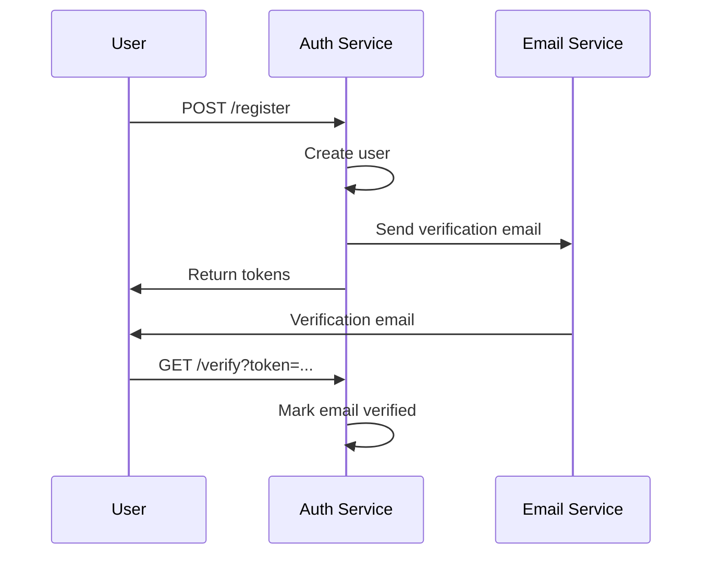
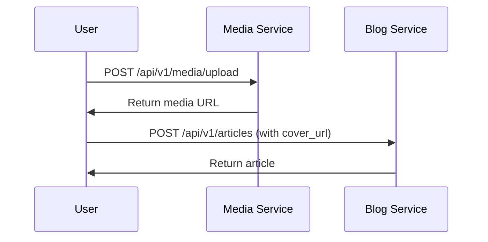

# 📚 Microblog Platform API Documentation

مجموعه کاملی از documentation برای Microblog Platform API شامل Swagger/OpenAPI، Postman Collection، و ابزارهای مختلف تست.

## 📁 فایل‌های موجود

### 🔧 Core Documentation

- **`swagger.yaml`** - فایل OpenAPI 3.0 کامل
- **`SWAGGER_SETUP.md`** - راهنمای استفاده از Swagger
- **`API_DOCUMENTATION.md`** - این فایل

### 🚀 Postman Collection

- **`Microblog-API.postman_collection.json`** - Collection کامل Postman
- **`Microblog-Environment.postman_environment.json`** - Environment variables
- **`POSTMAN_SETUP.md`** - راهنمای استفاده از Postman

### 🌐 Web Interfaces

- **`swagger-ui.html`** - Swagger UI محلی
- **`redoc.html`** - Redoc documentation
- **`package.json`** - npm scripts برای documentation
- **`docker-compose.docs.yml`** - Docker setup برای documentation

## 🚀 راه‌اندازی سریع

### 1. Swagger UI Online

```bash
# باز کردن در Swagger Editor
open https://editor.swagger.io/
# فایل swagger.yaml را کپی و paste کنید
```

### 2. Swagger UI محلی

```bash
# با Docker
docker run -p 8080:8080 -e SWAGGER_JSON=/swagger.yaml -v $(pwd):/swagger swaggerapi/swagger-ui

# یا با npm
npm install -g swagger-ui-serve
swagger-ui-serve swagger.yaml
```

### 3. Redoc

```bash
# نصب و اجرا
npm install -g redoc-cli
redoc-cli serve swagger.yaml
```

### 4. Docker Compose

```bash
# اجرای تمام documentation services
docker-compose -f docker-compose.docs.yml up -d

# دسترسی به services:
# - Swagger UI: http://localhost:8080
# - Redoc: http://localhost:8081
# - Swagger Editor: http://localhost:8082
# - Custom HTML: http://localhost:8083
```

### 5. Postman

1. فایل `Microblog-API.postman_collection.json` را import کنید
2. فایل `Microblog-Environment.postman_environment.json` را import کنید
3. Environment "Microblog Environment" را انتخاب کنید

## 📊 API Services Overview

### 🔐 Auth Service (Port: 8081)

- User registration and login
- Email verification
- Password reset
- JWT token management
- User profile management

### 📝 Blog Service (Port: 8082)

- Article CRUD operations
- Category management
- Comment system
- Rating system
- Content moderation

### 📁 Media Service (Port: 8083)

- File upload and storage
- Media management
- File serving
- Image processing
- Access control

## 🎯 API Endpoints Summary

| Service   | Endpoints        | Description                      |
| --------- | ---------------- | -------------------------------- |
| **Auth**  | 8 endpoints      | Authentication & user management |
| **Blog**  | 12 endpoints     | Content management & interaction |
| **Media** | 5 endpoints      | File upload & media handling     |
| **Total** | **25 endpoints** | Complete platform API            |

## 🔧 Development Tools

### Swagger Tools

- **Swagger Editor**: Online editor و validator
- **Swagger UI**: Interactive API documentation
- **Swagger Codegen**: Code generation
- **Redoc**: Beautiful documentation

### Postman Features

- **Auto Token Management**: خودکار ذخیره JWT tokens
- **Response Validation**: تست‌های خودکار
- **Environment Variables**: مدیریت متغیرها
- **Collection Runner**: اجرای batch tests

### Testing Tools

- **Newman**: Command-line Postman runner
- **Insomnia**: Alternative API client
- **HTTPie**: Command-line HTTP client
- **curl**: Traditional HTTP testing

## 📋 Quick Start Guide

### 1. Setup Services

```bash
# اجرای MongoDB
docker run -d --name mongo -p 27017:27017 mongo:7

# اجرای MailHog
docker run -d --name mailhog -p 1025:1025 -p 8025:8025 mailhog/mailhog

# اجرای سرویس‌ها
cd auth-service && go run cmd/server/main.go &
cd blog-service && go run cmd/server/main.go &
cd media-service && go run cmd/server/main.go &
```

### 2. Test Authentication

```bash
# ثبت‌نام کاربر
curl -X POST http://localhost:8081/register \
  -H "Content-Type: application/json" \
  -d '{"email":"user@example.com","password":"password123"}'

# ورود کاربر
curl -X POST http://localhost:8081/login \
  -H "Content-Type: application/json" \
  -d '{"email":"user@example.com","password":"password123"}'
```

### 3. Test Blog Service

```bash
# ایجاد مقاله
curl -X POST http://localhost:8082/api/v1/articles \
  -H "Content-Type: application/json" \
  -H "Authorization: Bearer YOUR_TOKEN" \
  -d '{"title":"My Article","content":"Content here","summary":"Summary","category_id":"cat123"}'

# دریافت مقاله
curl http://localhost:8082/api/v1/articles/my-article
```

### 4. Test Media Service

```bash
# آپلود فایل
curl -X POST http://localhost:8083/api/v1/media/upload \
  -H "Authorization: Bearer YOUR_TOKEN" \
  -F "file=@image.jpg"

# دریافت اطلاعات فایل
curl http://localhost:8083/api/v1/media/MEDIA_ID
```

## 🔐 Authentication Flow

### 1. User Registration



### 2. Content Creation



## 📊 API Statistics

### Endpoint Distribution

- **Public Endpoints**: 8 (32%)
- **Protected Endpoints**: 17 (68%)
- **Admin Only**: 3 (12%)
- **Manager+ Only**: 2 (8%)

### HTTP Methods

- **GET**: 10 endpoints (40%)
- **POST**: 10 endpoints (40%)
- **PUT**: 3 endpoints (12%)
- **DELETE**: 2 endpoints (8%)

### Response Codes

- **200 OK**: Success responses
- **201 Created**: Resource creation
- **204 No Content**: Successful deletion
- **400 Bad Request**: Client errors
- **401 Unauthorized**: Authentication required
- **403 Forbidden**: Insufficient permissions
- **404 Not Found**: Resource not found
- **500 Internal Server Error**: Server errors

## 🛠️ Advanced Usage

### Custom Headers

```http
Authorization: Bearer <jwt-token>
Content-Type: application/json
X-Request-ID: unique-request-id
X-User-Role: author
```

### Query Parameters

```http
GET /api/v1/articles?page=1&page_size=10&status=approved&category_id=cat123&tag=technology
```

### File Upload

```http
POST /api/v1/media/upload
Content-Type: multipart/form-data
Authorization: Bearer <token>

file: <binary-data>
```

### Pagination

```json
{
  "success": true,
  "data": {
    "list": [...],
    "total": 100,
    "page": 1,
    "size": 10,
    "pages": 10
  }
}
```

## 🔍 Troubleshooting

### Common Issues

1. **Connection Refused**

   - سرویس‌ها در حال اجرا نیستند
   - Port ها اشغال هستند
   - Firewall مسدود کرده

2. **401 Unauthorized**

   - Token منقضی شده
   - Token نامعتبر
   - Authorization header نادرست

3. **403 Forbidden**

   - دسترسی کافی ندارید
   - Role مناسب نیست
   - Resource متعلق به شما نیست

4. **404 Not Found**
   - Endpoint اشتباه
   - Resource وجود ندارد
   - ID نامعتبر

### Debug Commands

```bash
# بررسی وضعیت سرویس‌ها
curl http://localhost:8081/health
curl http://localhost:8082/health
curl http://localhost:8083/health

# بررسی لاگ‌ها
tail -f auth-service/logs/auth.log
tail -f blog-service/logs/blog.log
tail -f media-service/logs/media.log

# بررسی ایمیل‌ها
open http://localhost:8025
```

## 📈 Performance & Monitoring

### Response Times

- **Auth Service**: < 100ms
- **Blog Service**: < 200ms
- **Media Service**: < 500ms (upload dependent)

### Rate Limits

- **Authentication**: 10 requests/minute
- **Content Creation**: 5 requests/minute
- **File Upload**: 2 requests/minute

### Monitoring Endpoints

```http
GET /health - Health check
GET /metrics - Performance metrics
GET /status - Service status
```

## 🚀 Deployment

### Production Setup

1. **Load Balancer**: Nginx/HAProxy
2. **SSL/TLS**: Let's Encrypt
3. **Rate Limiting**: Redis-based
4. **Monitoring**: Prometheus + Grafana
5. **Logging**: ELK Stack

### Docker Deployment

```bash
# Production deployment
docker-compose -f docker-compose.prod.yml up -d

# Documentation deployment
docker-compose -f docker-compose.docs.yml up -d
```

## 📚 Resources

### Documentation

- [OpenAPI Specification](https://swagger.io/specification/)
- [Swagger UI](https://swagger.io/tools/swagger-ui/)
- [Redoc](https://redoc.ly/)
- [Postman](https://learning.postman.com/)

### Best Practices

- [REST API Design](https://restfulapi.net/)
- [JWT Authentication](https://jwt.io/introduction/)
- [Microservices Testing](https://microservices.io/patterns/testing/)
- [API Security](https://owasp.org/www-project-api-security/)

### Tools & Libraries

- [Swagger Codegen](https://swagger.io/tools/swagger-codegen/)
- [Newman](https://learning.postman.com/docs/running-collections/using-newman-cli/command-line-integration-with-newman/)
- [Insomnia](https://insomnia.rest/)
- [HTTPie](https://httpie.io/)

---

**نکته**: این documentation برای development و testing طراحی شده است. برای production، تنظیمات امنیتی و performance مناسب را اعمال کنید.

## 🤝 Contributing

برای مشارکت در documentation:

1. Fork کنید
2. تغییرات را اعمال کنید
3. Pull request ارسال کنید
4. Code review انجام دهید

## 📄 License

MIT License - برای جزئیات بیشتر فایل LICENSE را مطالعه کنید.
